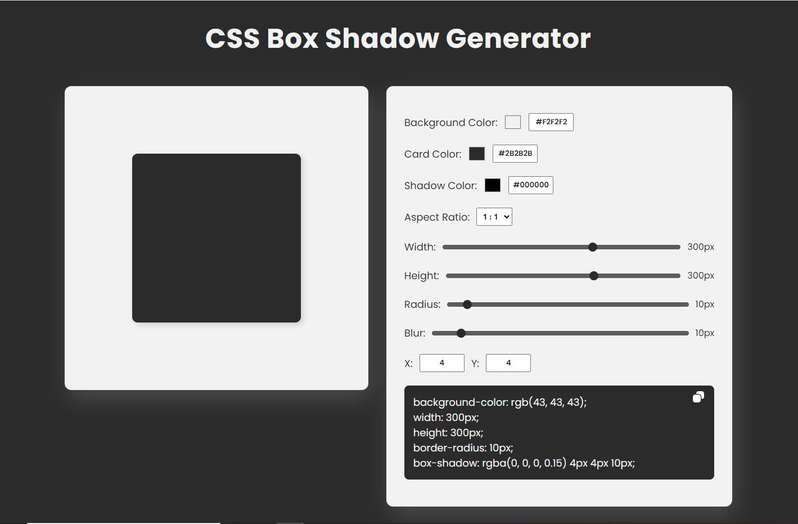

# CSS-Box-Shadow-Generator
CSS Box Shadow Generator where you can create card with box shadow and play around with the CSS attributes.

  

## Features
1. Customize Card and Shadow Colors
2. Aspect Ratio Settings
3. Copy the CSS Code to clipboard
4. Responsive Layout

[Click here](https://css-box-shadow-generator.glitch.me) to preview the project!
